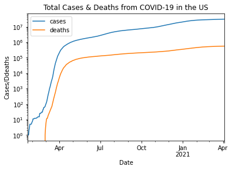

# BFOR 206 Lab
## Class 10-1: Analyzing Covid-19 data

# Task Description

In this lab, we will download the latest Covid statistics
and use pandas/pyplot to visualize case statistics.

The data we will use comes from a New York Times
[Github repository](https://github.com/nytimes/covid-19-data).

# Normal Scenario

## Input
**Remote File:** NYTimes Covid-19 data.

## Output
**Terminal:** Tables and plots as described below.

# Test Cases

## Case 1: Plot Cases & Deaths

Plot in a single chart (with log scale) total cases and total deaths.

Expected Output:

# Submission instructions

**Scripts that produce unhandled errors will not be accepted!**

Run your script to show that it produces output that
matches the test cases.

When you are finished, submit two screenshots on Blackboard:
1.  A screenshot of your code.
2.  A screenshot of output that looks very
    similar to the output in the test cases.
